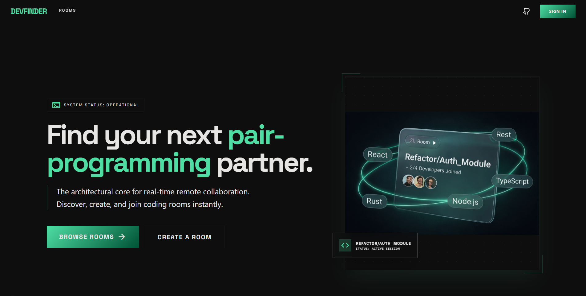
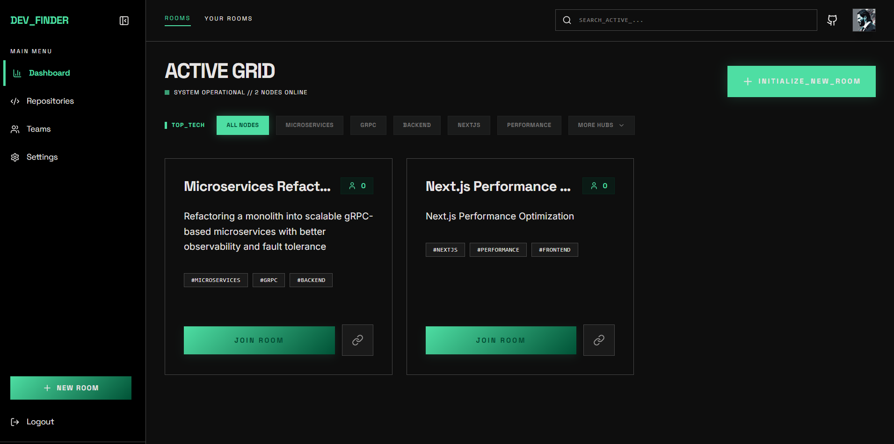
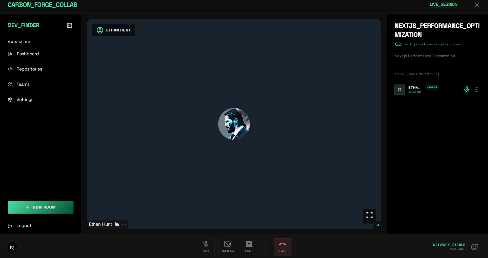
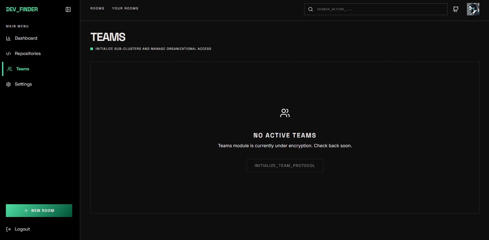

# DevFinder

DevFinder is a platform for developers to host, find, and join live collaboration sessions. Whether you are hosting a daily stand-up or a hackathon, DevFinder provides high-performance video and audio conferencing coupled with search-driven room discovery.










## Key Features

- **Real-time Video Collaboration**: High-quality video and audio conferencing tracks with screen sharing powered by the Stream.io SDK.
- **Dynamic Node Discovery**: Browse a global grid of active "nodes" (rooms) with real-time participant counts and GitHub context.
- **Intelligent Tech Filtering**: Quickly find rooms by technology stack using our tiered tag directory and top-trending filters.
- **Secure Host Permissions**: Integrated moderation controls allowing creators to manage participants and session states efficiently.
- **Premium Fluid UI**: A state-of-the-art interface with glassmorphism aesthetics, fully optimized for both desktop and mobile viewports.

## Technology Stack

- **Framework**: [Next.js 15 (App Router)](https://nextjs.org/)
- **Styling**: [Tailwind CSS](https://tailwindcss.com/)
- **Collaboration**: [Stream.io SDK](https://getstream.io/video/)
- **Database**: [PostgreSQL (Neon)](https://neon.tech/) & [Drizzle ORM](https://orm.drizzle.team/)
- **Authentication**: [NextAuth.js](https://next-auth.js.org/) (Google Provider)
- **UI Components**: [Radix UI](https://www.radix-ui.com/) & [Lucide React Icons](https://lucide.dev/)

## Getting Started

### Prerequisites

- Node.js 18+
- PostgreSQL database (e.g., Neon)
- Stream.io API Keys

### Installation

1. **Clone the repository**
   ```bash
   git clone https://github.com/Ethan4582/dev-finder.git
   cd dev-finder
   ```

2. **Install dependencies**
   ```bash
   npm install
   ```

3. **Set up environment variables**
   ```bash
   cp .env.example .env.local
   ```
   
   Configure the following variables in your `.env`:
   ```env
   DATABASE_URL=your_postgresql_url
   GOOGLE_CLIENT_ID=your_google_id
   GOOGLE_CLIENT_SECRET=your_google_secret
   NEXTAUTH_SECRET=your_nextauth_secret
   NEXT_PUBLIC_GET_STREAM_API_KEY=your_stream_api_key
   GET_STREAM_SECRET_KEY=your_stream_secret_key
   ```

4. **Initialize Database**
   ```bash
   npm run db:push
   ```

5. **Run the development server**
   ```bash
   npm run dev
   ```

## Contributing

1. Fork the repository
2. Create a feature branch (`git checkout -b feature/improvement`)
3. Commit your changes (`git commit -m 'Added enhancement'`)
4. Push to the branch (`git push origin feature/improvement`)
5. Open a Pull Request

## License

This project is licensed under the MIT License.
